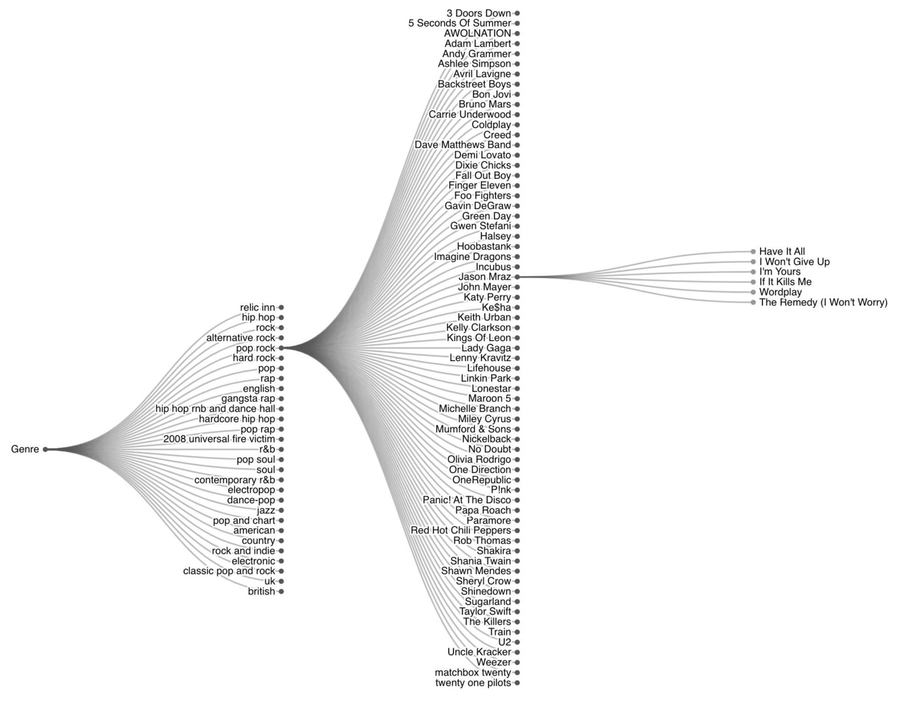
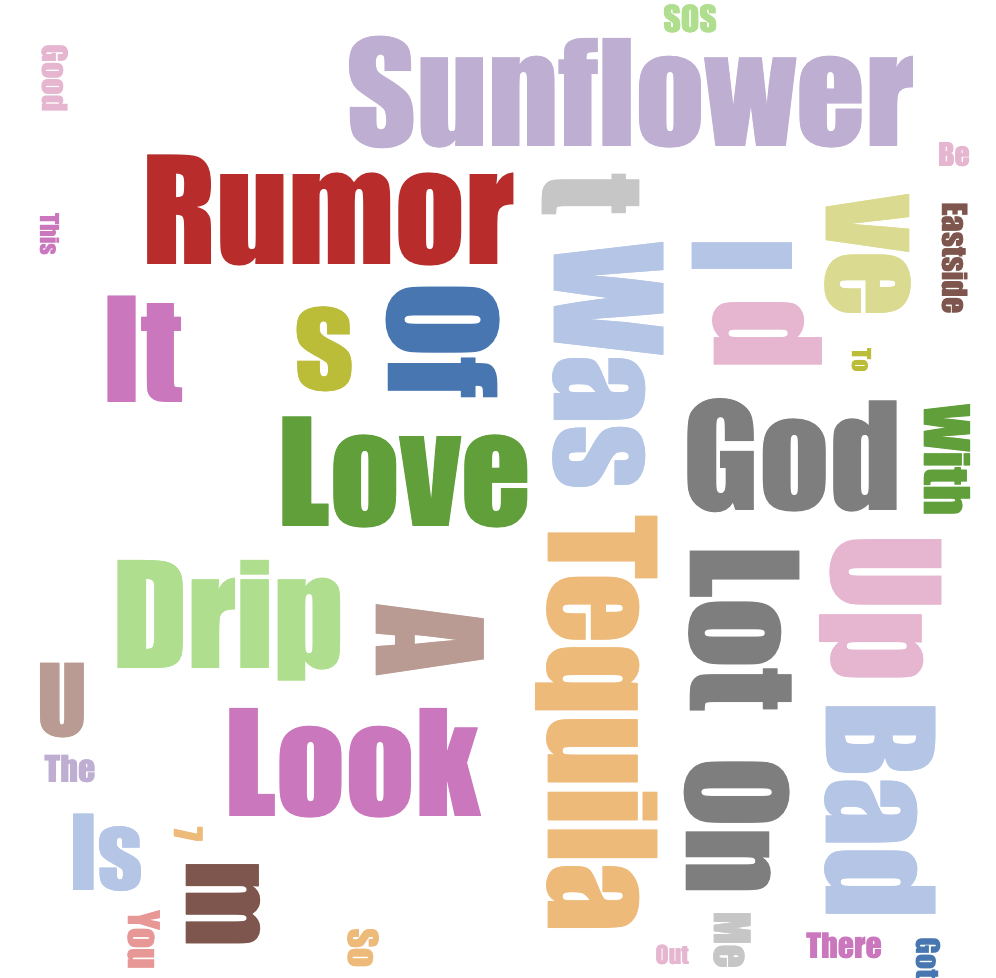
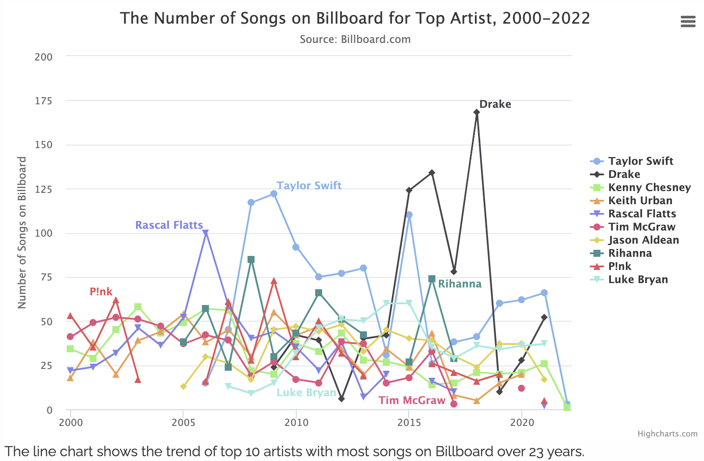

# Milestone 2

### Link  to our website: 

### Sketches of the visualizations

#### Expandable tree

We would like to figure out the connections among genres, artists and songs. Hence we create an expandable tree that shows the main genres and the most popular artists for each genre. And then for each artist, their most recognised work are included. Further, we would like to connect each song to their lyrics, sentiment analysis result, year of publish, and the social events. Highcharts was used for creating it.

#### WordCloud Animation for Song Names

Don't know how to pick a good name for your song? This wordCloud animation might inspire you! By looking at the animation, you will get an idea of how the most popular songs at 21st century are named, which might help you choose a good name for your own piece of music work. This animation is generated on top of D3.js template.

#### Trend of the Famous Musician

For the 10 highly ranked artists on Billboard, we generate a linechart to see how their popularity was changed over year. As we can see, although Taylor Swift is the musician with most work recognised over time, Drake on the other hand reached the highest ever number of songs on Billboard in 2018. 