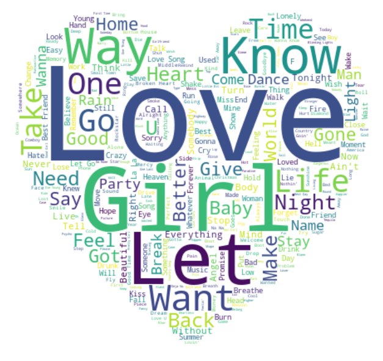

# Milestone 1 (08.04.2022)

Last update: 08.04.2022

## Dataset 
For our project, we used multiple datasets or created them independently. They will be explained in the following.

- [Billboard "The Hot 100" Songs](/data/billboard.csv): This dataset is from [kaggle](https://www.kaggle.com/datasets/dhruvildave/billboard-the-hot-100-songs) and is a collection of "The Hot 100" charts released since its inception in 1958 until 06.11.2021. The dataset is preprocessed and ready to use (Usability score on kaggle 10/10). We will use the data from 2000 on; for this, we removed the data before that year. We added the missing weeks until 01.01.2022 since we need those weeks for later analysis.

-  [Lyrics](/data/lyrics.csv): We did not find a comprehensive lyrics dataset that contains most of the lyrics of the Billboard dataset. We used the [Genius API](https://docs.genius.com/) to create the dataset on our own. If the API does not find the songs, we ignore them for now. We will add them manually during the project using sources such as [LyricFind](https://www.lyricfind.com/). 

- [Genres](/eda/artist_genres.json) : Genres related to each artist have been scraped using the [MusicBrainz API](https://beta.musicbrainz.org/). 

- [Google Trends Dataset](/data/trends.csv): This dataset has been found on [kaggle](https://www.kaggle.com/datasets/dhruvildave/google-trends-dataset). It includes Google Trends data from 2001 until 2020 and groups them by region, category, year and rank. [pytrends](https://pypi.org/project/pytrends/) could also be useful in this project for more specific purposes. 

## Problematic

Music is present everywhere, and probably you are listening to it now. It is a part of our culture and society. By this connection, how are musical trends related to major social events? By analyzing the chart trends and popular songs of the past 22 years, we want to explore if there is a significant change in trending music linked or correlated to social movements, for example, on Google Trends or trending Twitter hashtags. The project aims to investigate whether there is a correlation or connection between social trends or changes and successful songs.

To achieve this goal, we will examine the lyrics of the top songs in depth using NLP and visualize the most recurring themes by genre or year.

In the end, we want to create an interactive website that gives an overview of the music and time history of the last 22 years. The user should be able to click through the years and get an overview of social developments and also about musically successful songs. We let the user play with interactive visualizations to make comparisons, adjust charts and get different perspectives on the topic. We will use our time data to create linked charts where you can zoom in and filter to gain a deeper insight and a better feel for the data.

## Exploratory Data Analysis

Please find our EDA in the following links to the notebooks and some interesting findings. 

1. [Billboard dataset (notebook)](/eda/billboard.ipynb)
- from 2000 to 2021, there were 9316 distinct songs on the charts 
- the most popular song during the period is Blinding Lights, performed by The Weeknd, which stayed on Billboard for 90 weeks. 
- the dataset contains 4238 distinct artists 
the 3 most popular artists in this timeframe are Taylor Swift (136 songs), Drake (104 songs) and Kanye West (51 songs)

2. [Lyrics dataset (notebook)](/eda/lyrics.ipynb)
- Most frequent lyrics language after English (7840 titles) is Spanish (144 titles)
- Song title length
    - longest: "My City Of Ruins (Benefiting Artists For Peace And Justice Haiti Relief) [Live From The Kennedy Center Honors]" by Eddie Vedder
    - shortest: "8" by Billie Eilish
- most common word is "I" (132068 occurrences) 
- songs are more negative (7823 songs) than positive (5542 songs)

3. [Genre dataset](/eda/artist_genres.json)
- relationship between different genres

4. [Trends dataset](/data/trends.csv)
- evolution of trends

## Related work

**Work that has been done**

For the `billboard.csv` section, since it is downloaded from Kaggle, some basic analysis on rankings of the top artists and top songs can be found on Kaggle. However, since essentially we only want to get the song and artist name and do our further analysis on lyrics, analysis solely on rankings will not be our primal interest.

With regards to the `lyrics.csv` section scraped from genius API, it is constructed by us and so we do not expect a lot of similar work to be found. Moreover, we restrict the scale of our exploration to the 21st century (2000-2022) and focus on top 100 songs on billboard, which makes the dataset more likely to be unique. [Billboard Top 25](https://github.com/christianmoya/BillboardTop25_NLP) analysis found on github built up several basic models on a dataset scraped from genious and Billboard.

**Originality of Approach**

The original thing about our project is that we want to identify trends without focusing on one artist or genre and also put this analysis in a socio-social context if one exists.

**Inspiration**

We got great inspiration for visualization and implementation from the following projects.

-  [Textual analysis of popular country music](https://www.johnwmillr.com/trucks-and-beer/): A project to analyze country music in-depth and find more not so apparent correlations between the artist and lyrics. For example, which artist mentions trucks most often in their songs. Also, it is an excellent resource for storytelling with data.

-  [49 Years of Lyrics: Why So Angry?](https://towardsdatascience.com/49-years-of-lyrics-why-so-angry-1adf0a3fa2b4): Here, the lyrics from 1970 - 2018 are examined in sentimental analysis. It gives us valuable hints about text processing and sentiment analysis.

- [Step by Step to Visualize Music Genres with Spotify API](https://towardsdatascience.com/step-by-step-to-visualize-music-genres-with-spotify-api-ce6c273fb827): Music genres are visualized using the [Spotify API](https://developer.spotify.com/documentation/web-api/). For us, it is an excellent resource for visualizations.

