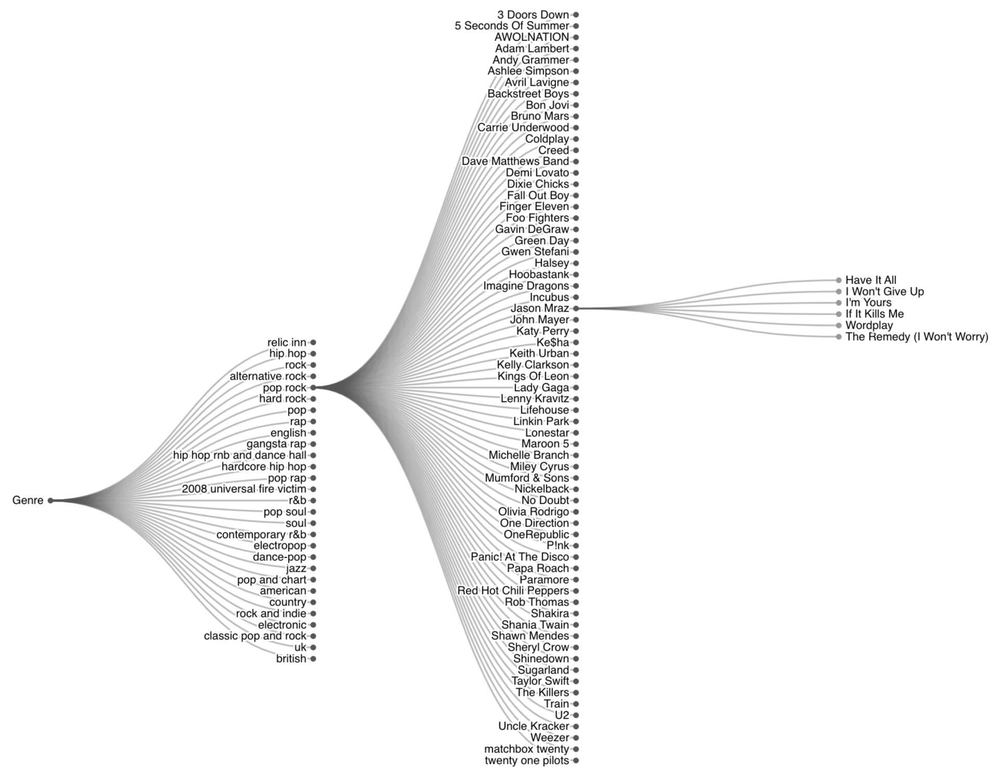
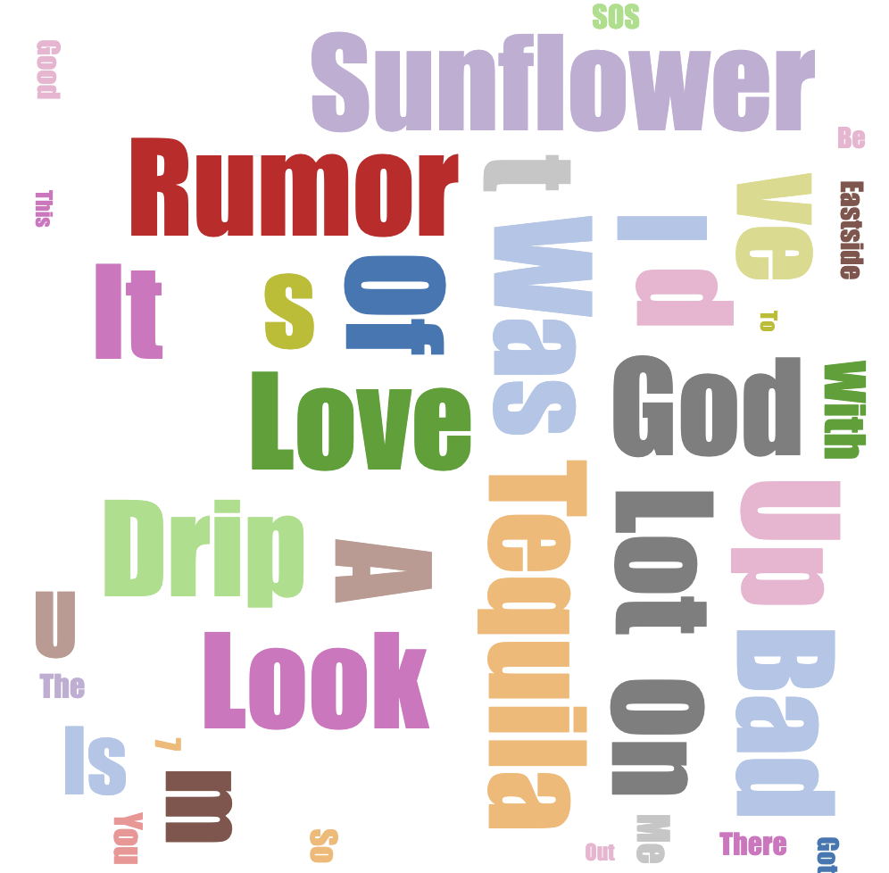
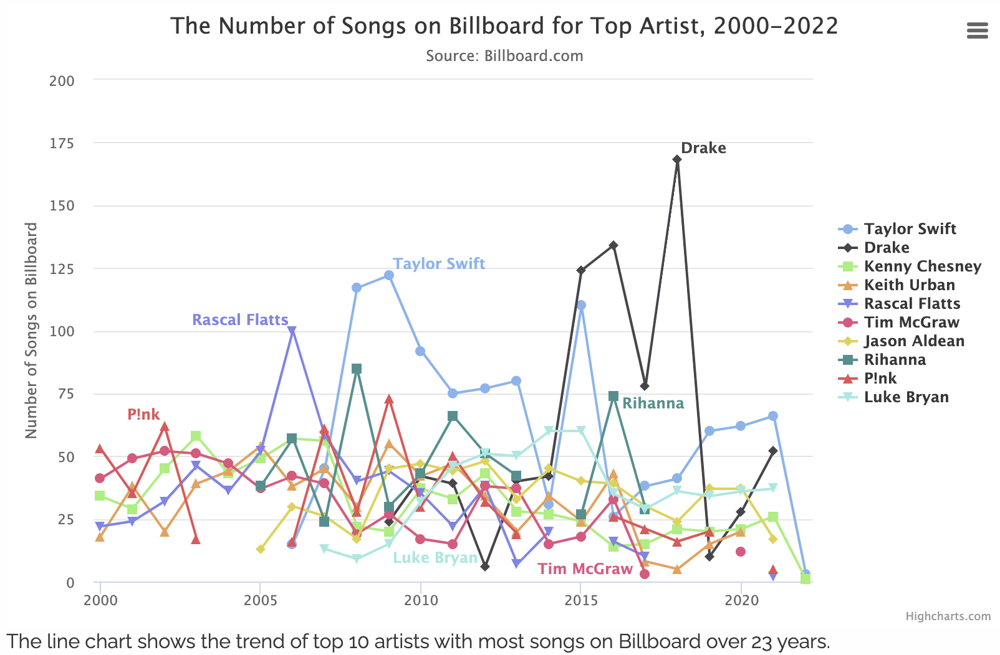
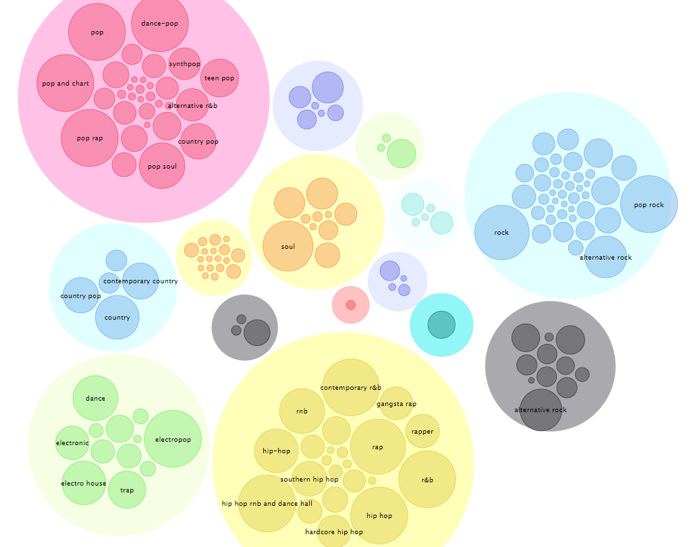
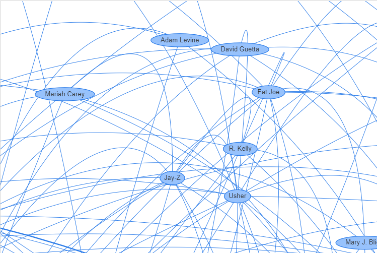

# Milestone 2

Last Update: 06.05.2022

Check out our cool and partially interactive visualizations [here](https://com-480-data-visualization.github.io/datavis-project-2022-vizards/).

## Game Plan
To organize our project, we broke down our goal into subtasks to achieve it. These subtasks are

- *Quantitative Analysis*: Our data reveals interesting trends, such as the most successful artists or songs. But also how, for example, the popular genres have changed in the last 22 years. The ingredient is to take the mass of data and find interesting correlations and visualize them.
  
- *Qualitative Analysis*: Besides the beat, the lyrics are essential for songs. In this part we will look at song lyrics and other qualitative characteristics such as "danceability" or "energy".Haven't you always wondered whether it's easier to dance to Kanye's or Taylor's songs? Don't worry, we'll answer the question already in this milestone 😉. 
- Merge: TODO

In the following we will deal with the quantitative and qualitative analysis of the data set. The last component will be dealt with in the final milestone, as it is based on the other two analyses mentioned. These two analyses help to narrow down time periods and topics.

## Sketches of the visualizations

### Quantitative Analysis

**[Expandable tree](https://com-480-data-visualization.github.io/datavis-project-2022-vizards/charts/genre_tree.html)**

We would like to figure out the connections among genres, artists and songs. Hence we create an expandable tree that shows the main genres and the most popular artists for each genre. And then for each artist, their most recognised work are included. Further, we would like to connect each song to their lyrics, sentiment analysis result, year of publish, and the social events. Highcharts was used for creating it.

**[WordCloud Animation for Song Names](https://com-480-data-visualization.github.io/datavis-project-2022-vizards/charts/song_name_wordcloud.html)**

Don't know how to pick a good name for your song? This wordCloud animation might inspire you! By looking at the animation, you will get an idea of how the most popular songs at 21st century are named, which might help you choose a good name for your own piece of music work. This animation is generated on top of D3.js template.

**[Trend of the Famous Musician](https://com-480-data-visualization.github.io/datavis-project-2022-vizards/charts/top_artists_linechart.html)**

For the 10 highly ranked artists on Billboard, we generate a linechart to see how their popularity was changed over year. As we can see, although Taylor Swift is the musician with most work recognised over time, Drake on the other hand reached the highest ever number of songs on Billboard in 2018. 

**[Genres Popularity Bubble Chart](https://com-480-data-visualization.github.io/datavis-project-2022-vizards/charts/genres_bubbles.html)**

Subgenres can be grouped into larger genre categories. The goal was to visualize which are the most popular genres and how much each subgenre contributes to its given category. 

We used Highcharts for the animated graph. A score has been assigned to each subgenre according to its number of occurrences and its rank in the Billboard in a linear fashion : higher is the subgenre occurrence rank, higher is the given score. 

**[Top 100 Collaborative Artists Network](https://com-480-data-visualization.github.io/datavis-project-2022-vizards/charts/collaboration_network.html)**

The Top 100 most collaborative artists are extracted and shown on a network graph with all the collaborations between them. 
